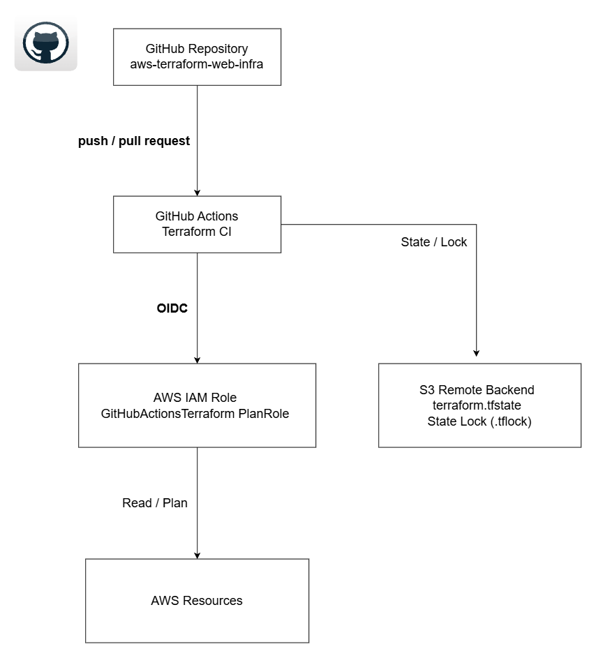
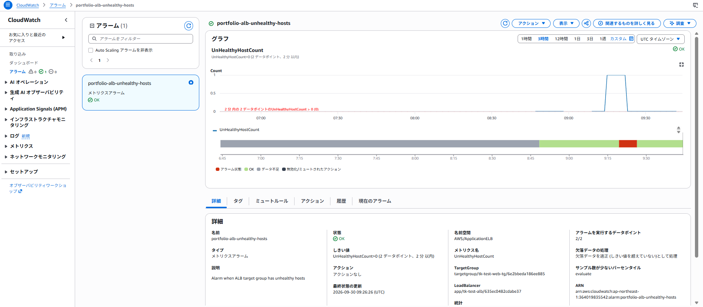
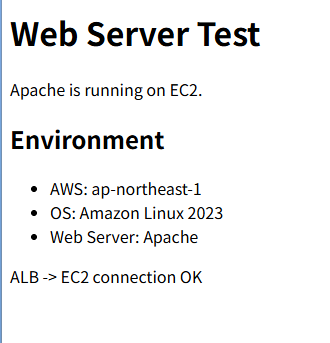

# AWS Terraform Web Infrastructure

Terraformを使用したAWS Webインフラストラクチャの構築ポートフォリオ。

## 概要

AWSのネットワーク・Web・データベース・監視構成をInfrastructure as Code（IaC）として実装。

Terraformによるインフラ構築に加え、S3 Remote BackendによるState管理、GitHub ActionsによるTerraform CI、OIDCを利用したAWS認証、CloudWatchによる監視を実装。

## 構成

- VPC
- Public Subnet × 2（2AZ）
- Private Subnet × 2（2AZ）
- Internet Gateway
- Route Table
- Application Load Balancer（ALB）
- Target Group
- EC2（Amazon Linux 2023）
- RDS for MySQL
- DB Subnet Group
- Security Group
- Apache HTTP Server
- CloudWatch Alarm
- S3 Remote Backend
- GitHub Actions
- GitHub OIDC / IAM Role

## 構成図


## アーキテクチャ

```text
Internet
   ↓
Internet Gateway
   ↓
Application Load Balancer
   ↓
Target Group
   ↓
EC2 / Apache
   ↓
RDS for MySQL
```

ALBおよびEC2をPublic Subnet、RDSをPrivate Subnetに配置。

DB Subnet Groupには異なるAZの2つのPrivate Subnetを登録。

## セキュリティ設計

### ALB → EC2

ALBではインターネットからのHTTP（TCP/80）を許可。

EC2ではALBのSecurity GroupからのHTTP通信のみ許可し、インターネットからEC2への直接HTTPアクセスを制限。

### EC2 → RDS

RDSのPublic Accessを無効化し、Private Subnetに配置。

RDSのSecurity Groupでは、EC2のSecurity GroupからのMySQL（TCP/3306）のみ許可。

インターネットからRDSへの直接アクセスを許可しない構成。

## Terraform State管理

Terraform StateはS3 Remote Backendで管理。

```text
S3 Bucket
└── portfolio/
    └── terraform.tfstate
```

TerraformのState Lockを有効化し、複数のTerraform実行によるStateの競合を防止。

RDSのパスワードなどの機密情報はTerraformコードへ直接記述せず、Terraform変数として管理。

`terraform.tfvars` は `.gitignore` の対象とし、GitHubリポジトリへの登録を除外。

## GitHub Actions / CI

GitHub Actionsを利用したTerraform CIを構築。

mainブランチへのpushおよびPull Requestをトリガーとして、Terraformコードのチェックを自動実行。

### CI / State Management 構成図



### AWS認証

GitHub ActionsからAWSへの認証にOIDC（OpenID Connect）を使用。

AWSアクセスキーをGitHub Secretsへ長期保存せず、GitHub ActionsからIAM Roleを一時的に引き受ける構成。

CI用IAM RoleはAWSリソースに対する読み取り権限を基本とし、Terraform State Lockに必要なS3オブジェクトのみ書き込み・削除を許可。

`terraform apply` はCIの対象外とし、意図しないインフラ変更を防止。

## CloudWatchによる監視

ALB Target Groupの `UnHealthyHostCount` をCloudWatch Alarmで監視。

Target Group内にUnhealthyなターゲットが発生した場合に異常を検知する構成をTerraformで実装。

### 監視設定

- Namespace: AWS/ApplicationELB
- Metric: UnHealthyHostCount
- Period: 60秒
- Evaluation Periods: 2
- Threshold: 0
- Condition: UnHealthyHostCount > 0

### 障害・復旧試験

監視の動作確認として、EC2 Security GroupのALBからのHTTP（TCP/80）許可ルールを一時的に削除。

ALBからEC2へのヘルスチェックを意図的に失敗させ、以下を確認。

1. ALB Target Groupのターゲットが `Healthy` から `Unhealthy` に変化
2. `UnHealthyHostCount` が 0 から 1 に変化
3. CloudWatch Alarmが `OK` から `ALARM` に変化

その後 `terraform plan` を実行し、AWS上で手動変更したSecurity GroupとTerraformコードとの差分（drift）を検出。

`terraform apply` によってSecurity GroupをTerraformの定義状態へ復旧し、Target Groupが `Healthy`、CloudWatch Alarmが `OK` に戻ることを確認。

```text
Normal
  ↓
Security Group rule removed
  ↓
ALB Health Check timeout
  ↓
Target: Unhealthy
  ↓
UnHealthyHostCount = 1
  ↓
CloudWatch Alarm: ALARM
  ↓
terraform plan (drift detection)
  ↓
terraform apply
  ↓
Target: Healthy
  ↓
CloudWatch Alarm: OK
```

### CloudWatch Alarm 動作確認



## 動作確認

TerraformによるAWSリソース作成後、ALBのDNS名へブラウザからアクセスして動作確認を実施。

以下の経路でHTTP通信が正常に行えることを確認。

```text
Internet
   ↓
Application Load Balancer
   ↓
Target Group
   ↓
EC2
   ↓
Apache
```

Target GroupのヘルスチェックがHealthyとなること、およびApacheのテストページが表示されることを確認。

### ブラウザからのアクセス確認



## コストを考慮した検証構成

本番環境ではWebサーバーをPrivate Subnetへ配置する構成を想定。

本ポートフォリオでは検証コストを抑えるためNAT Gatewayを使用せず、EC2をPublic Subnetへ配置。起動時にApacheをインストールする構成。

EC2にはPublic IPv4アドレスを付与する一方、Security GroupによってALBからのHTTP通信のみ許可。

RDSは検証用途のためSingle-AZ構成を採用。

## 今後の課題

- EC2のPrivate Subnetへの配置
- NAT GatewayまたはVPC Endpointの導入
- Auto ScalingによるWebサーバーの冗長化
- RDS Multi-AZ構成
- HTTPS（ACM）の導入
- Terraform Moduleによるコードの再利用