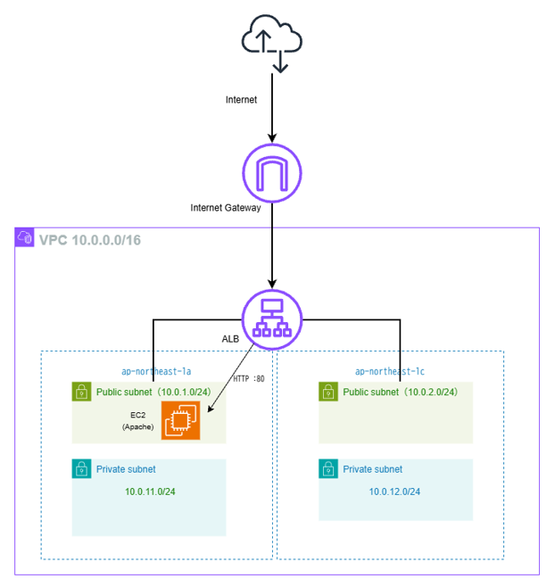

# AWS Terraform Web Infrastructure

Terraformを使用して、AWS上にWebインフラストラクチャを構築するポートフォリオ。

## 概要

AWSの基本的なネットワーク・Web構成をInfrastructure as Code（IaC）として実装。

### 構成

- VPC
- Public Subnet × 2（2AZ）
- Private Subnet × 2（2AZ）
- Internet Gateway
- Route Table
- Application Load Balancer（ALB）
- Target Group
- EC2（Amazon Linux 2023）
- Security Group
- Apache HTTP Server

## 構成図

## アーキテクチャ

Internet
↓
Internet Gateway
↓
Application Load Balancer
↓
Target Group
↓
EC2
↓
Apache

## セキュリティ設計

ALBはインターネットからのHTTPを許可。

EC2はALBに設定したSecurity GroupからのHTTPのみ許可し、
インターネットからEC2への直接アクセスを許可しない構成としています。

## コストを考慮した検証構成

本番環境を想定した場合、WebサーバーはPrivate Subnetへ配置する構成を想定。

本ポートフォリオでは検証コストを抑えるためNAT Gatewayを使用せず、EC2をPublic Subnetへ配置して起動時にApacheをインストールできる構成とする。

EC2にはPublic IPv4アドレスを付与しますが、
Security GroupによってALBからのHTTP通信のみ許可しています。

## 今後の改善

- EC2のPrivate Subnetへの配置
- NAT GatewayまたはVPC Endpointの導入
- Auto Scalingによる冗長化
- HTTPS（ACM）の導入
- CloudWatchによる監視
- Terraform Moduleによるコードの再利用